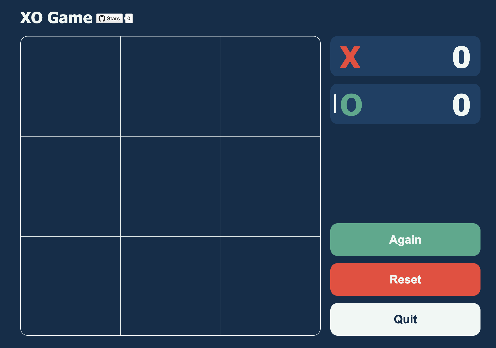

# 🎮 XO Game [](https://github.com/TheMachinist01/xo-game/stargazers)
A simple Tic-Tac-Toe game built with [Vue 3](https://vuejs.org/) and [Vite](https://vitejs.dev/).  
This is a small practice project, ideal for learning component-based UI design and basic game logic.

## 🖼️ Screenshot


## 🌐 Live Demo
👉 [Play it online on GitHub Pages](https://themachinist01.github.io/xo-game/)

> Or download the production build:  
> [📦 xo-game-v1.0.0-production-ready.zip](https://github.com/TheMachinist01/xo-game/releases/download/v1.0.0/xo-game-v1.0.0-production-ready.zip)

## 🚀 Features
- ✅ Responsive layout
- ✅ Simple, clean UI
- ✅ Game restart and win-detection logic
- ✅ Vuex-based state management
- ✅ No external CSS frameworks — just plain SCSS

## 🧑‍💻 Run Locally
```bash
git clone https://github.com/TheMachinist01/xo-game.git
cd xo-game
npm install
npm run dev
```

## 📦 Build for Production
```bash
npm run build
npm run preview
```
Or use a static file server:
```bash
npm install -g serve
serve dist
```

## 🚀 Deploy on GitHub Pages
If you want to deploy the project yourself:
1. Set `base: '/xo-game/'` in `vite.config.js`
2. Install the deploy package:
```bash
npm install --save-dev gh-pages
```
3. Add this to your `package.json`:
```json
"scripts": {
  "deploy": "gh-pages -d dist"
}
```
4. Then run:
```bash
npm run build
npm run deploy
```

## 📄 License
This project is licensed under the [MIT License](./LICENSE).

## 📜 Full Changelog
See: [GitHub Commits](https://github.com/TheMachinist01/xo-game/commits/main/)
